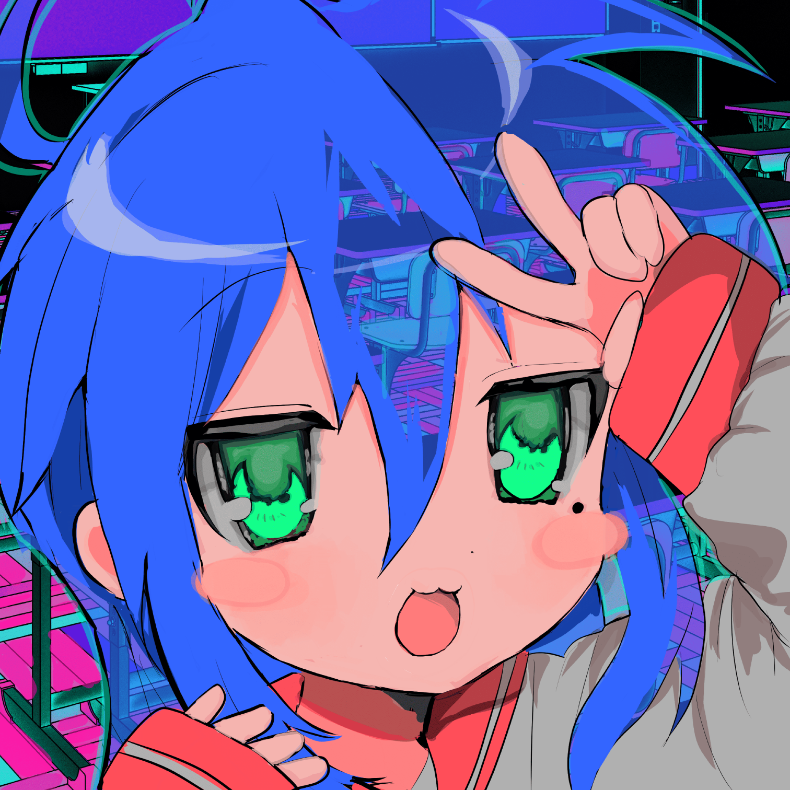

  
  

  
  
  

  

    <samp>
      <b>
        lunar@archlinux:~$
      </b>
    </samp>
     
  

  

  
_Hello, welcome!_

_I'm a **dumbass** coder_

_Has [autism](https://en.wikipedia.org/wiki/Autism)_

_Proud [Linux](https://github.com/torvalds/linux) user_

## _stats_

## _trophies_

